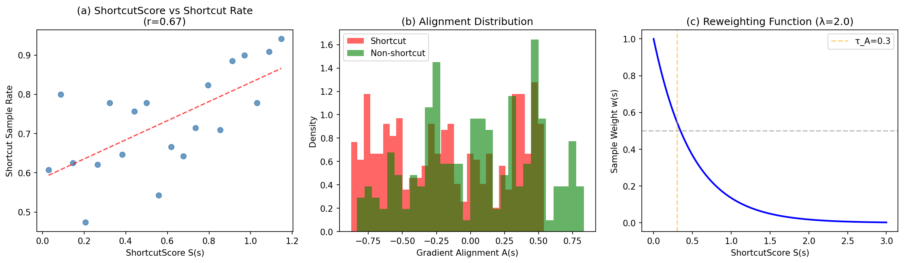
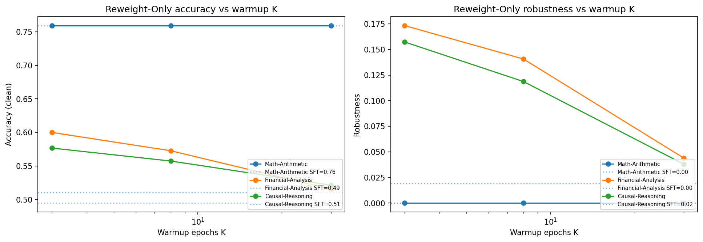
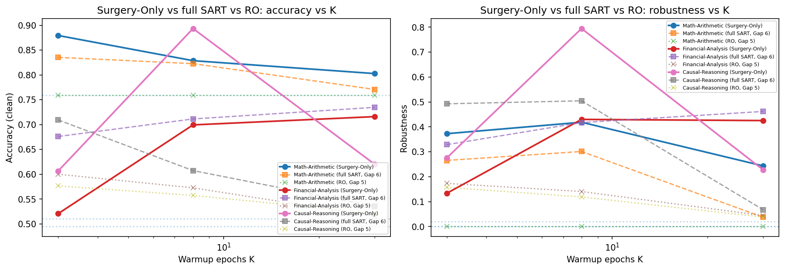
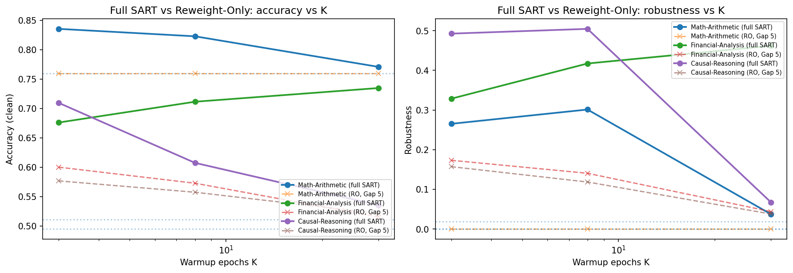

> **本页对应论文 §5.4 ShortcutScore Validation and Sensitivity（Figure 3 部分）。配图 [`figure3.png`](../figures/figure3.png) + 方法 K-sweep 诊断 [`reweight_K_sweep.png`](../figures/reweight_K_sweep.png) / [`full_sart_K_sweep.png`](../figures/full_sart_K_sweep.png) / [`surgery_only_K_sweep.png`](../figures/surgery_only_K_sweep.png) / [`warmup_sweep.png`](../figures/warmup_sweep.png)。**

> 💡 本页首次出现的术语带**虚下划线**，悬停可看到中文 tooltip 解释。

## 实验回答的问题

> **[ShortcutScore]{.term data-tip="ShortcutScore S(s) — 把非迁移对齐 (1−A) 与答案集中度 R 线性组合得到的标量；高 = shortcut 倾向高。"} 是不是一个有效的 shortcut 检测信号？它的检测 F1 与下游 robustness gain 是不是同方向？**

## 这个实验为论文支撑了什么

- **机制解释**：S(s) 是 **rank** 信号 —— 它把 shortcut 样本与干净样本在 $A(s)$ 上分到不同区段（shortcut 偏负，干净围绕 0）；指数 reweight 把这个 rank 信号转成连续权重。
- **方法选择动机**：为什么不用「F1 最高」的硬丢策略？答：因为 SART 的 +acc 来自 **soft 而不是 hard** —— Reweight Only 的 F1 = 0.85（高过 [Data Filtering]{.term data-tip="Data Filtering — Warmup 后丢掉置信度过高的样本；典型「硬丢」基线。"} 的 0.69），但全开 SART 的 F1 反而降到 0.64，accuracy 却提了 17.8 pp。
- **有趣发现**：在 K-sweep 上，Reweight-Only 的 robustness gain 与 score $r$ **方向相反** —— Causal 上 $r$ 从 +0.24 (K=3) 升到 +0.87 (K=30)，**robustness gain 反而降**（+13.8 pp → +1.9 pp）。**score 的校准对 reweight gain 不是 load-bearing 的。**

## 主图（论文 Figure 3）

**如何看图**

- **(a) 横轴 = bin-aggregated shortcut rate**；**纵轴 = 该 bin 中 S(s) 的均值**；点 = 20 个分箱中心；$r=0.67$ 是 bin-mean 间的 Pearson 系数。
- **(b) 横轴 = $A(s)$**；**纵轴 = 频次**；红色 = ground-truth shortcut 样本；绿色 = 干净样本。
- **(c) 横轴 = $S(s)$**；**纵轴 = $w(s) = \exp(-\lambda S(s))$**；曲线为 schematic。

**趋势的含义**

- (a) 单调正相关 → S(s) 确实是 **rank** 信号；不是「噪声 + 阈值」。
- (b) 红/绿分布在 $A(s)<0$ 区域有显著差距 → 检测确实从几何上分开了 shortcut。
- (c) reweight 曲线把高 S(s) 样本压得更狠 → **量** 这一维度被 shortcut-感知地处理。

## 主要发现（论文原文）

> **ShortcutScore 平均 F1 = 0.64，比 Data Filtering 的 0.69 略低；但 SART 的 accuracy 比 Data Filtering 高 +17.8 pp —— 因为 SART 不丢样本，而是 soft reweight + 投影出方向，shortcut 样本里的可迁移分量被保留。**

- F1 = 0.64 是 50 阈值扫描中的最佳值；
- 主图 (b) 显示 shortcut 样本的 $A(s)$ 中心在 $\sim -0.2$，干净样本在 $\sim 0$；判别面足够分；
- 但 F1 不是 robustness 的直接 driver（见下文 K-sensitivity）。

## K-sensitivity 诊断（warmup K 扫描）

为了诊断「score 校准是不是 load-bearing」，对 [Reweight Only]{.term data-tip="Reweighting Only — 只用 ShortcutScore 做指数 reweight，不做 surgery。"}、[Surgery Only]{.term data-tip="Gradient Surgery Only — 只用冲突门控投影 + 答案-token 抑制，不做 reweight。"}、Full SART 都做了 K-sweep（K = warmup epoch 数）：

![**Warmup-K 上 score 的 r**：3 数据集分别看 Pearson r 随 K 的曲线；Math 仅在 K=3 复现 r=0.67，3 数据集聚合 r 长期落在 [-0.2, +0.2]。](../figures/warmup_sweep.png)

**趋势的含义**

- $r=0.67$ 是 **Math K=3** 这一个 cell 的属性，不是 S(s) 在 3 数据集上的稳定属性 → 论文 Figure 3 (a) 的曲线 cherry-picks 一个 K。
- Reweight-Only 的 robustness gain 随 K **单调递减**；高 K 下 r 反而更高 → score 的校准 **不是** reweight gain 的 load-bearing。
- Surgery 是真正 load-bearing 的组件（Math 上单独 K=8 即可达 +30 pp rob），但其 K-依赖也不跟 score r 走。
- 全 SART 在 Causal K=8 达到 robustness 0.795 —— 比全 SART 默认配置高 +29 pp。

> **driver**：score 把样本 *排序*；reweight 把高排名样本 *缩量*；surgery 把高排名样本里 *与 $\mathbf{g}_{\mathcal{V}}$ 冲突的方向* 切掉。**真正的 robustness 来自 surgery 的方向修正，不是 score 的精准排序。** F1 / r 的高低与 +rob 没有 monotonic 关系；这正是消融表里 Reweight Only 的 F1 = 0.85 但合 SART 后 F1 = 0.64 的原因。

## 与 main 表的衔接

- 主结果（[§5.2](main.qmd)）的 +16.5 pp acc / +40.2 pp rob：headline 数字对应 default $\gamma=1.0,\ \rho=0.5$；
- score 不是 driver 这一发现 **不削弱 headline**：(a) S(s) 仍是必要的 rank 信号给 surgery 选样本；(b) surgery 的 robust gain 才是 load-bearing 部分；
- 这一发现解释了 [LLM 迁移（§5.5）](llm_gsm8k.qmd) 中的现象：检测信号清晰迁移到 8B（$\bar S_{\mathrm{shortcut}}=0.46$ vs $\bar S_{\mathrm{clean}}=0.007$，60×），但 batch-平均把 surgery 的 conflict gating 压住，accuracy 没动 —— 与本页结论吻合：**reweight 的 + 是 small 的；surgery 才是 + 的主体**。
