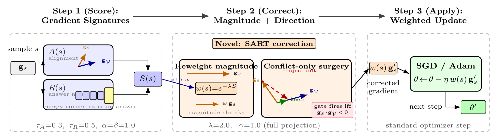

> **本页对应论文 §3 Overview，配图 [`sart_method_figure`](../figures/sart_method_figure.png)。**

> 💡 本页首次出现的术语带**虚下划线**，悬停可看到中文 tooltip 解释。

## 一句话 takeaway

> **SART 在一个 SGD step 里同时做两件事：用 [ShortcutScore]{.term data-tip="ShortcutScore S(s) — 把非迁移对齐 (1−A) 与答案集中度 R 线性组合得到的标量；高 = shortcut 倾向高。"} 给样本 reweight（缩量），用 [conflict-only projection]{.term data-tip="冲突门控投影 — 只在内积 < 0 时才执行投影，避免把已经对齐的有用方向也擦掉。"} 给梯度做手术（改向）。两路独立而互补。**

## 配图

**如何看图**

- (A) **检测信号**：每个样本同时读两路梯度信号 — 与 [$\mathbf{g}_{\mathcal{V}}$]{.term data-tip="g_V — 验证集梯度 ∇_θ (1/|V|) Σ ℓ(θ;v)；代表「能改善真规则泛化」的更新方向。"} 的余弦（$A(s)$）+ 答案-token 占比（$R(s)$）。
- (B) **检测合成**：$S(s)=\alpha\,\max(0,\tau_A-A(s))+\beta\,\max(0,R(s)-\tau_R)$。
- (C) **缩量**：[$w(s)$]{.term data-tip="样本权重 — w(s)=exp(−λ S(s))；ShortcutScore 高 → 权重小 → 梯度贡献被压缩。"} = $\exp(-\lambda S(s))$。
- (D) **改向**：仅当 $\mathbf{g}_s^\top \mathbf{g}_{\mathcal{V}} < 0$ 时执行投影 — 这是 [PCGrad]{.term data-tip="PCGrad (Yu et al. 2020) — 多任务学习里通过把任务梯度投影到彼此正交方向来化解冲突的算法。"} 风格的冲突门控；正向对齐的有用分量保留。
- (E) **更新**：模型参数沿改良后的梯度走，整体偏向真推理。

**两路信号为什么互补**

- reweight 调 **how much** — 把 shortcut 样本的整体贡献缩小；
- surgery 调 **in which direction** — 在 shortcut 样本里也保留正向对齐的有用分量，把真正冲突的方向擦掉；
- 单独 reweight 留下「方向有害但量被压小」的残余；单独 surgery 留下「方向已修正但量还跟干净样本一样大」的残余；两路合一才能闭环。

## 三阶段训练

| 阶段 | 目的 | 操作 |
|------|------|------|
| 1. Warmup | 用 $K$ epoch 标准 SFT 让 $\mathbf{g}_{\mathcal{V}}$ 形成稳定方向 | 全样本等权，无 surgery |
| 2. Scoring | 计算 $\mathbf{g}_{\mathcal{V}}$、逐样本 $\mathbf{g}_s$；得到 $A(s)$ / $R(s)$ / $S(s)$ / $w(s)$ | 基于一次 backward |
| 3. Reweighted retraining | 带 $w(s)$ 训剩余 epoch；每步先 reweight 再 surgery | 每隔 $k=5$ 步重算 [$\mathbf{g}_{\mathcal{V}}$]{.term data-tip="g_V — 验证集梯度 ∇_θ (1/|V|) Σ ℓ(θ;v)；代表「能改善真规则泛化」的更新方向。"} |

[$K$]{.term data-tip="K — Warmup 阶段 epoch 数；reweighting 与 surgery 在 K 之后才生效。论文默认 max(5, epochs/6)。"} 的默认值 $\max(5,\,\text{epochs}/6)$；论文 §5.4 显示 $K$ 对组合方法不敏感，但对单独 reweight 是敏感的（细节见 [消融研究](../experiments/ablation.qmd)）。

## 与既有方法的差别

| 既有方法 | 调什么 | 缺什么 |
|---------|--------|--------|
| [Data Filtering]{.term data-tip="Data Filtering — Warmup 后丢掉置信度过高的样本；典型「硬丢」基线。"} / [Influence Filtering]{.term data-tip="Influence Filtering — 估计每个样本对验证损失的影响，丢掉影响最负的。"} | 硬丢样本 | 丢掉了同一样本里的可迁移分量 |
| 标签去噪 / curriculum | label / loss | 看不到 shortcut（标签是对的） |
| [JTT]{.term data-tip="Just Train Twice — 两阶段：用先前阶段的错样本上权重再训。"} / [LfF]{.term data-tip="Learning from Failure — 训一个偏置网络，用其错样本作为去偏信号。"} | scalar loss | 看不出「shortcut 学得快」vs「难样本」 |
| [Group DRO]{.term data-tip="Group DRO — Sagawa 等 2020，最坏组损失最小化；需要组标注。"} | 最坏组 | 需要组标注 |
| [IRM]{.term data-tip="IRM — Invariant Risk Minimization，跨环境不变表示；需要多环境划分。"} / [V-REx]{.term data-tip="V-REx — Risk Extrapolation，最小化跨环境损失方差。"} / [Fishr]{.term data-tip="Fishr — 跨环境梯度方差正则化。"} | 跨环境不变性 | 需要环境划分 |
| Meta-reweight | 权重 | 不动方向；不去除 shortcut 方向上的更新 |

> **driver**：SART 只用 *已有* 数据 + 一个 *小* 验证集，从梯度几何 **同时** 解决检测 + 抑制；没有外部标注。

## 接下来读什么

- [ShortcutScore（§4.1）](shortcut_score.qmd) — $A(s)$ / $R(s)$ / $S(s)$ / $w(s)$ 的逐步形式化。
- [Gradient Surgery（§4.2）](gradient_surgery.qmd) — 冲突门控投影 + 答案-token 抑制。
- [LLM 工程优化](vram_reduction.qmd) — LoRA + JL 草图 + $\mathbf{g}_{\mathcal{V}}$ 周期刷新让 SART 在 8B 上可跑。
